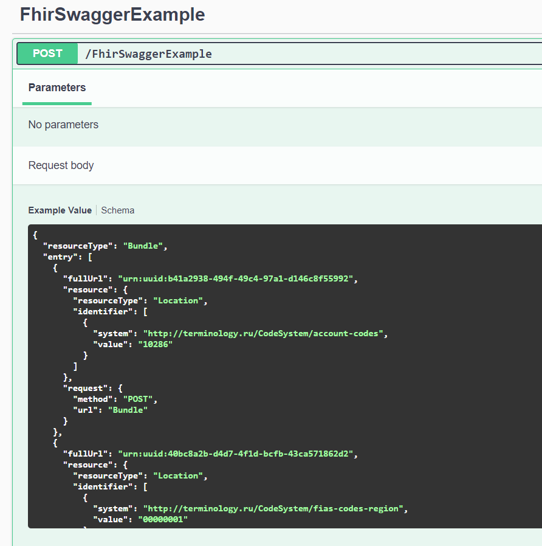

### The problem
As mentioned at https://github.com/FirelyTeam/firely-net-sdk/issues/1201 Hl7.Fhir have strange compatibility with System.Text.Json

If you want to use FHIR models from Hl7.Fhir package in your swagger, you should use few hacks:
1. Use Newtonsoft.Json as main json library and the [custom serializer](FhirModelsJsonConverter.cs) from mentioned issue 
    ```
    services.AddControllers()
            .AddNewtonsoftJson(
                options => options.SerializerSettings.Converters.Add(new FhirModelsJsonConverter()));
    ```
2. [Implement IExamplesProvider<YourClass>](BundleExample.cs)

3. Register those two extensions from Swashbuckle.AspNetCore.Filters package
   ```
   services.AddSwaggerGen(c => c.ExampleFilters());
   services.AddSwaggerExamplesFromAssemblyOf<Startup>();
   ```
4. Enjoy!
   